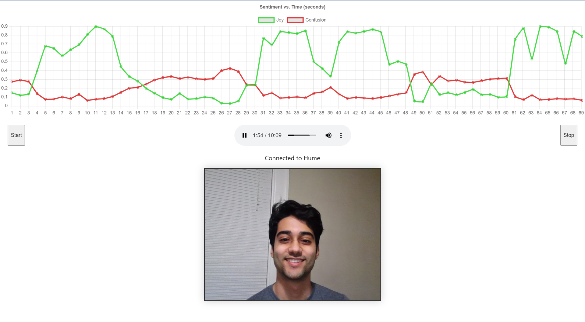

# Hume Director Aide

This is a prototype built to help performing group directors review recordings faster with empathic AI. 

## Motivation

Reviewing long rehearsal recordings in detail while simultaneously remembering all of your notes is hard for directors to do, and typically requires lots of pausing and rewinding to find specific sections (source: personal experience). However, Hume's empathic AI automatically identifies key emotional moments with zero additional user input. Directors want to review key moments; this tool makes it easy to find those key moments.

## Current Failure Modes

This MVP reveals some failure modes of the current design and underlying technology:

- 48-dimensional emotions are difficult to project to a 1D linear scale
  - I guessed that "Joy" and "Confusion" would be good dimensions
- Emotions are highly variable between people
  - My grimace results in a high "Joy" score if I show my teeth
  - Musician "stank face" results in a high "Confusion" score
  - Someone else may use a different set of expressions entirely
- This design forces users to think about their face
  - The goal is for users to ignore the camera, but they won't
